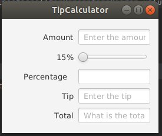
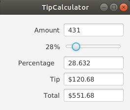
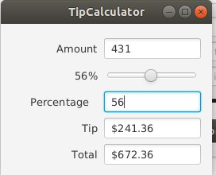

# tip-calculator-modified-
Author Burulsun Taalaibekova

Initial state:

If you pool the slider it will change its value from 15-100 and calculate the tip and total accordingly;

If you write the percentage on the empty field, it will assign the value of a tip percentage and will calculate the tip and total bill accordingly

